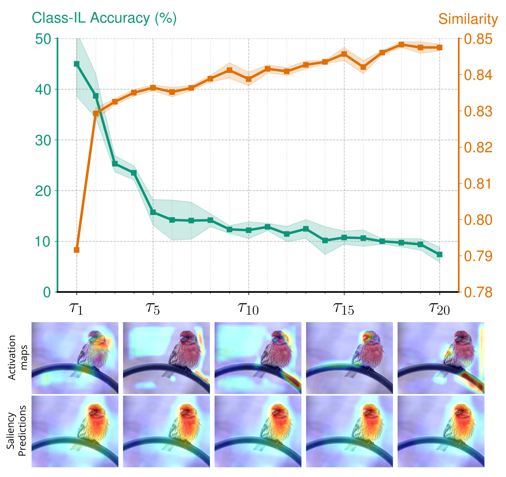
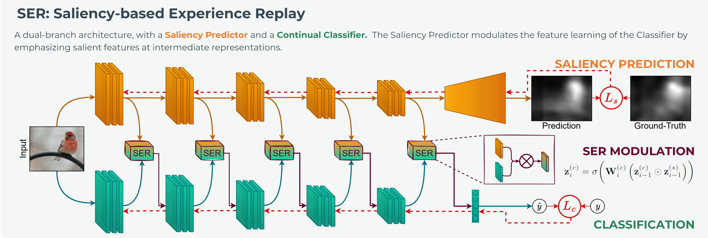

<div align="center">    
 
# SER: Saliency-driven Experience Replay for Continual Learning
G. Bellitto, F. Proietto Salanitri, M. Pennisi, M. Boschini, L. Bonicelli, A. Porrello, S. Calderara, S. Palazzo, C. Spampinato


[](https://openreview.net/forum?id=8KkBxzn0km)
[](https://)


</div>

# 🔍 Overview

The official PyTorch implementation for paper __"Saliency-driven Experience Replay for Continual Learning"__. 

SER is a biologically-inspired saliency-driven modulation strategy for online continual learning, which regularizes classification features using visual saliency, effectively reducing forgetting.
The proposed approach, grounded on neurophysiological evidence, significantly improves performance of state-of-the-art OCL methods, and has been shown to be superior to other multibranch solutions, either biologically-inspired (e.g., DualNet) or based on attention mechanisms (e.g., TwF).

<div align="center">
 
</div>

### 📄 Paper abstract

We present Saliency-driven Experience Replay - SER - a biologically-plausible approach based on replicating human visual saliency to enhance classification models in continual learning settings. Inspired by neurophysiological evidence that the primary visual cortex does not contribute to object manifold untangling for categorization and that primordial saliency biases are still embedded in the modern brain, we propose to employ auxiliary saliency prediction features as a modulation signal to drive and stabilize the learning of a sequence of non-i.i.d. classification tasks. Experimental results confirm that SER effectively enhances the performance (in some cases up to about twenty percent points) of state-of-the-art continual learning methods, both in class-incremental and task-incremental settings. Moreover, we show that saliency-based modulation successfully encourages the learning of features that are more robust to the presence of spurious features and to adversarial attacks than baseline methods.

<div align="center">
  
</div>

#### Read the full SER paper on [OpenReview](https://openreview.net/forum?id=8KkBxzn0km).


### 📂 Repository details

This repo relies on the [Mammoth Framework](https://github.com/aimagelab/mammoth) which has been modified to include the features described in the **SER** paper. 

# 💪 Training

The general command to launch a training is:

```shell
python utils/main.py --model derpp_ser --mnp multiply --mnp_blocks 1 1 1 1 1 --dataset seq-img100sal --buffer_size 2000 --lr 0.01 --batch_size 8 --minibatch_size 8 --alpha 0.1 --beta 0.5 --n_epochs 1 --sal_ckpt sal_checkpoints/chkpt_saliency_predictor.pth --sal_n_gaussians 0 --sal_lr 0.005 --sal_coeff 1.
```

# 📜 Citation

```bibtex
@inproceedings{bellittosaliency,
  title={Saliency-driven Experience Replay for Continual Learning},
  author={Bellitto, Giovanni and Salanitri, Federica Proietto and Pennisi, Matteo and Boschini, Matteo and Bonicelli, Lorenzo and Porrello, Angelo and Calderara, Simone and Palazzo, Simone and Spampinato, Concetto},
  booktitle={The Thirty-eighth Annual Conference on Neural Information Processing Systems}
}
```
